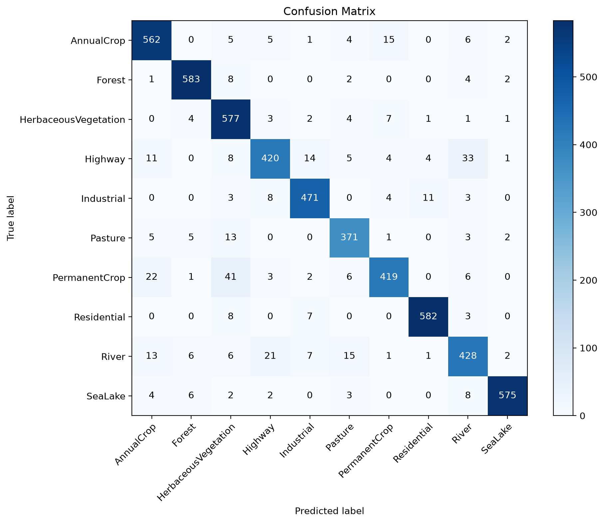
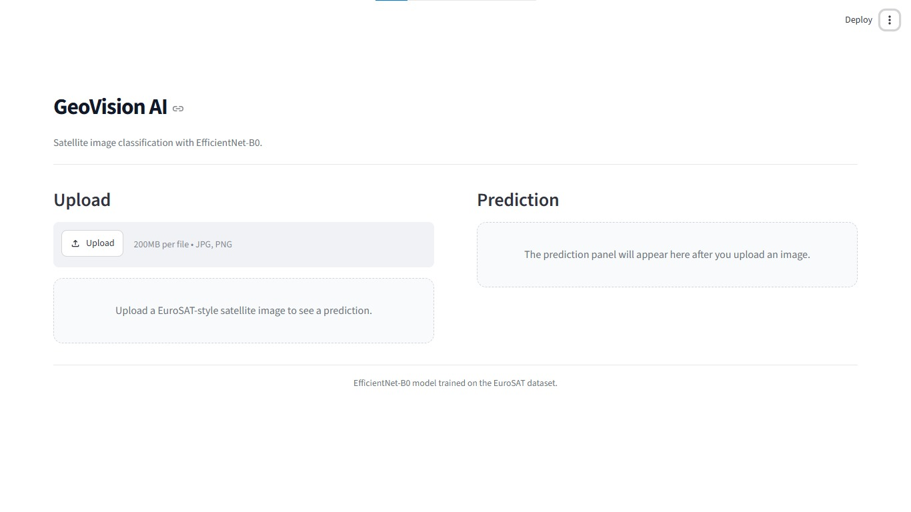
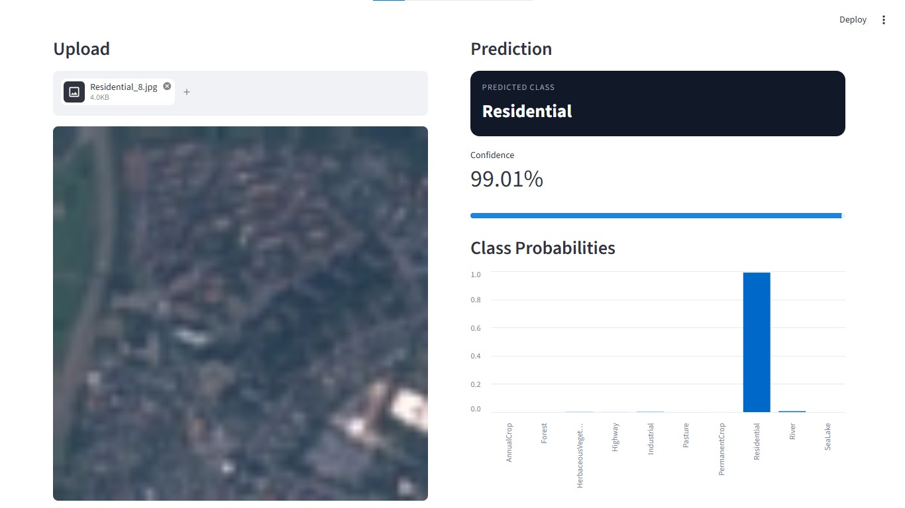

# GeoVision AI

GeoVision AI is a beginner-friendly satellite image classification project built with PyTorch, EuroSAT, and Streamlit.

## Problem

The goal is to classify satellite images into land-use categories such as `AnnualCrop`, `Forest`, `Highway`, `Residential`, `River`, and `SeaLake`.

## Dataset

The project uses the EuroSAT dataset from the Copernicus Data Space Ecosystem.

Dataset path used in this project:

```text
data/raw/EuroSAT/2750/
```

## Model

The model is `EfficientNet-B0` with a custom classification head for EuroSAT classes.

Training and evaluation flow:

- load image paths from `data/processed/dataset_index.csv`
- split into train and validation sets
- resize and normalize images
- train EfficientNet-B0
- save the best checkpoint to `models/best_model.pt`

## Results

Validation metrics:

- Accuracy: `0.9237`
- Precision: `0.9246`
- Recall: `0.9237`

Evaluation outputs:

- `experiments/logs/metrics.csv`
- `experiments/logs/confusion_matrix.png`

Confusion matrix:



## Dashboard

Run the app with:

```powershell
python -m streamlit run app/app.py
```

Dashboard features:

- upload a satellite image
- predict the class
- show confidence scores
- show class probabilities

## Screenshot

Dashboard upload screen:



Dashboard prediction result:



## Project Structure

- `app/` - Streamlit dashboard
- `data/raw/` - original dataset
- `data/processed/` - processed image index
- `experiments/logs/` - evaluation results
- `models/` - model definition, training, and evaluation
- `notebooks/` - exploration and preprocessing notebooks

## Setup

Create a virtual environment:

```powershell
python -m venv venv
```

Activate it:

```powershell
venv\Scripts\activate
```

Install dependencies:

```powershell
pip install -r requirements.txt
```

## Run

Start the dashboard:

```powershell
python -m streamlit run app/app.py
```

Run evaluation:

```powershell
python models/evaluate.py
```
